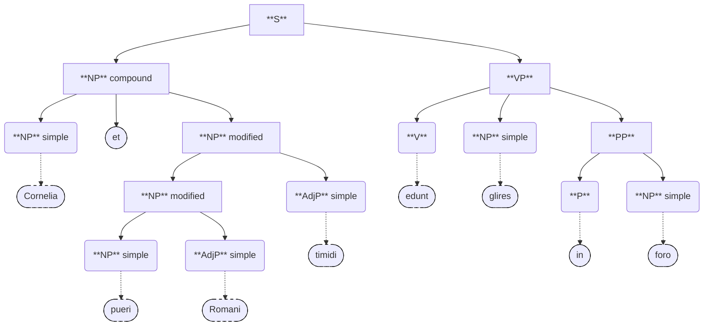

#  Discipulus

Machine Translating Latin!

**[Try me!](https://techno-sam.github.io/discipulus/)**

## What to look at

The main modern translation code is in [lib/grammar/latin/syntax_tree/](lib/grammar/latin/syntax_tree/)

## Translation Process

Modern translation works by building a syntax tree from nodes and linking rules.
Whitaker's Words is used to identify the parts of speech and their grammatical roles.

Ex:
```
01 puell.a              N      1 1 NOM S F                 
01 puell.a              N      1 1 VOC S F                 
01 puell.a              N      1 1 ABL S F                 
02 puella, puellae  N (1st) F   [XXXBO]  
03 girl, (female) child/daughter; maiden; young woman/wife; sweetheart; slavegirl;
```

### Node Types

See [lib/grammar/latin/syntax_tree/node/](lib/grammar/latin/syntax_tree/node/)

| Type          | Description                  |
|---------------|------------------------------|
| **S**         | Sentence                     |
| **NP_s**      | Noun phrase `simple`         |
| **NP_c**      | Noun phrase `compound`       |
| **NP_m**      | Noun phrase `modified`       |
| **NP_r**      | Noun phrase `rel clause`     |
| **AdjP_s**    | Adjective phrase `simple`    |
| **AdvP_s**    | Adverb phrase `simple`       |
| **VP**        | Verb phrase                  |
| **V**         | Verb (indicative)            |
| **V_s**       | Verb (indicative) `simple`   |
| **V_m**       | Verb (indicative) `modified` |
| **PP**        | Prepositional phrase         |
| **P**         | Preposition                  |
| **SBAR**      | Subordinate clause           |
| **Conj**      | Conjunction                  |
| **RelClause** | Relative clause              |
| **Rel**       | Relative pronoun             |

### Linking Rules

See [lib/grammar/latin/syntax_tree/transformers/](lib/grammar/latin/syntax_tree/transformers/) and [lib/grammar/latin/syntax_tree/parser.dart](lib/grammar/latin/syntax_tree/parser.dart)

**S**: NP{subj} VP{predicate}

**NP**: NP_s | NP_c | NP_m | NP_r | ~~NP PP~~  
**N_s**: `noun`  
**NP_c**: NP "et" NP  
**NP_m**: NP (AdjP_s)+  
**NP_r**: NP RelClause  
**AdjP_s**: `adjective`  
**VP**: V (NP\[acc\])? (NP\[dat\])? (PP)* (SBAR)?  
**V**: V_s | V_m  
**V_s**: `verb (indicative)`  
**V_m**: V_s (AdvP_s)+  
**AdvP_s**: `adverb`  
**PP**: P NP  
**P**: `preposition`  
**SBAR**: Conj S  
**Conj**: `conjunction (et, quod, etc.)`  
**Rel**: `relative pronoun (qui quae quod)`  
**RelClause**: Rel S  

### Parse Tree

`Cornelia et pueri Romani timidi edunt glires in foro.`



```
S -> Cornelia and the timid Roman boys eat the dormouses in the market
├── NP_c -> Cornelia and the timid Roman boys
│   ├── NP_s: Noun[Cornelia Corneliae] nom(Nominative)  S f(Feminine) -> Cornelia
│   ├── et
│   └── NP_m -> the timid Roman boys
│       ├── NP_s: Noun[puer pueri] nom(Nominative)  P m(Masculine) -> the boys
│       ├── AdjP_s: Adjective[romanus romana] nom(Nominative)  P m(Masculine) pos(Positive) -> Roman
│       └── AdjP_s: Adjective[timidus timida -um] nom(Nominative)  P m(Masculine) pos(Positive) -> timid
└── VP -> eat the dormouses in the market
    ├── V_s: Verb[edo edere]trans(transitive) pres(Present) ind(Indicative) 3P -> eat
    ├── NP_dirObj
    │   └── NP_s: Noun[glis gliris] acc(Accusative)  P m(Masculine) -> the dormouses
    └── PP -> in the market
        ├── P: Preposition[in] abl(Ablative) -> in
        └── NP_s: Noun[forum fori] abl(Ablative)    S n(Neuter) -> the market
```

## Running the Code

It's not currently very easy (and there is not yet a GUI), but it is possible.

You may prefer to use the [web version](https://techno-sam.github.io/discipulus/) instead.

### Prerequisites

- Dart SDK
- A build of [Whitaker's Words](https://github.com/mk270/whitakers-words) ([this](https://github.com/spr93/whitakers_latin_words) repository seems to be more up-to-date, but I haven't tested it)
- Rust

### Operation

1. Build the ffi bindings: `cargo build`
2. Modify line 91 of [lib/ffi/words_low_level.dart](lib/ffi/words_low_level.dart) to point to your Whitaker's Words build
3. Run `dart run buildscripts/test3.dart` to translate the sentence listed on line 28 in that file